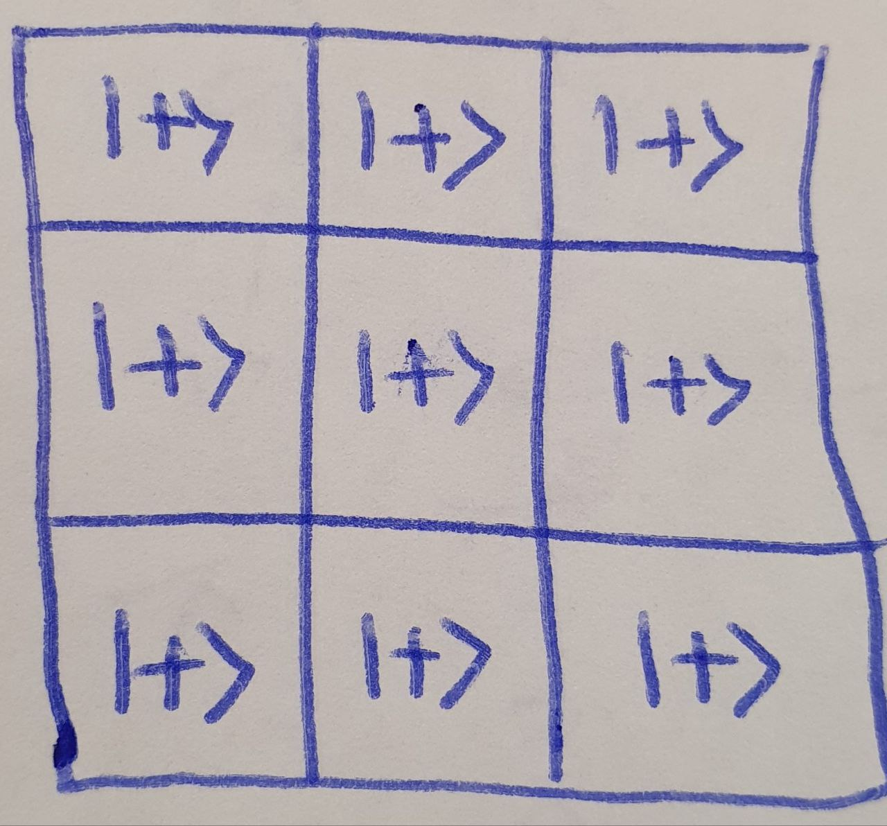

The session was held on May 8th, 2024. 
# Quantum Tic-Tac-Toe
## Introduction
This is a game similar to the classical Tic-Tac-Toe. There is a 3x3 grid of qubits which are initialized $\ket{+}$. Two players play against each other. In each iteration, a player can do one of the following operations:
1. Apply Hadamard on a qubit
2. Apply X (NOT) on a qubit
3. Apply a controlled-not (CNOT) on a control qubit and a target qubit

After a specific amount of moves, the game ends, and we measure the qubits. Based on the outcome of the measurement, the game would be a winning game for the first player or second player, or it's simply a draw.

**This environment can be a good candidate for a fully quantum environment**, but we should convert the classical reward.

## Implementation
[This GitHub code](https://github.com/LauraGentini/QRL) implemented both the environment and the agent. However, the agent uses states without measuring, so it is not useful for us.

Attention that this code works with previous versions of qiskit. For using the current compatible version, use [this pull request](https://github.com/alirezatwk/QRL). You just need to install gym and qiskit packages.